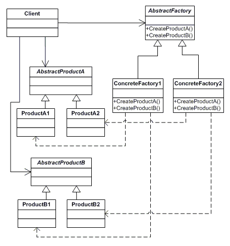
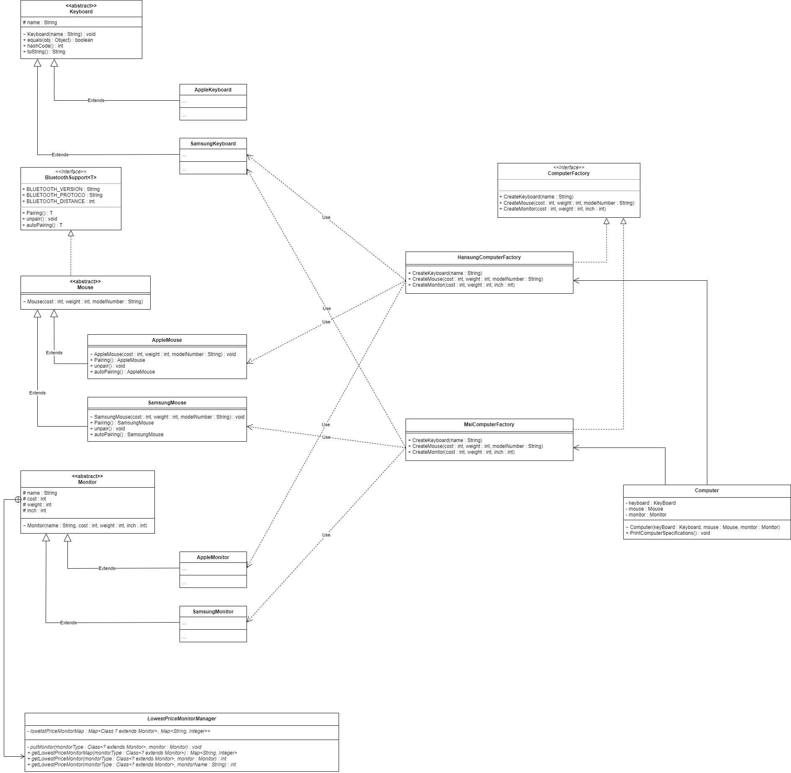

# 추상 팩토리 패턴(Abstract Factory Pattern)




> 객체 생성을 담당하는 구체 클래스를 상세하게 정의하지 않고도, 서로 의존성이 있거나 독립적인 여러 객체의 집합을 생성하기 위한 추상 클래스 혹은 인터페이스를 정의한다.
--------------------

## **생성 패턴(Creational Patterns)**
> 객체를 생성(클래스의 인스턴스를 만드는 절차), 합성(Compositon) 하는 방법을 기존 클래스에서 분리한다.  
>  **(SOLID, Single Responsibility Principle : 단일 책임 원칙)**

> 필요시 클래스의 인스턴스(instance)를 만드는 절차, 과정을 추상화(Abstraciton) 한다.

> 객체의 표현 방법을 기존 클래스에서 분리 한다.

-------------------


**BluetoothSupport**
> 블루투스 기능을 구현하기 위한 규약이 모인 인터페이스

**Computer**
> 컴퓨터를 표현하기 위한 클래스이다. 키보드, 모니터, 마우스를 표현한 객체를 필드에 인스턴스화 하여 사용하고 있다. 키보드, 모니터, 마우스는 컴퓨터를 이루는 제품군이다.  
> 
> 제품군은 컴퓨터의 부분 집합이며, 제품군의 라이프 타임 은 독립적이다.

**ComputerFactory**
> 구체 컴퓨터 객체의 제품군 생성을 담당하는 추상 팩토리 클래스이다.

**ComputerFactoty2**
> 구체 팩토리 객체를 캐싱하고, 캐싱된 구체 팩토리 객체를 제공하는 정적 팩토리 메소드를 가진 유틸리티 클래스.

**HansungComputerFactory**
> 한성 컴퓨터라는 구체 컴퓨터 객체의 제품군 생성을 담당하는 구체 팩토리 클래스이다.

**Msi

-------------------
### **구체적인 제품 객체의 정보를 클라이언트에게서 분리한다.**
>main 메서드를 살펴보자. 우리는 한성 컴퓨터 객체를 생성하기 위해, 한성 컴퓨터 팩토리 객체를 사용했다.
한성 컴퓨터 팩토리 객체는 한성 컴퓨터가 사용하는 제품군(삼성 키보드, 애플 마우스, 애플 모니터)을 만들어 한성 컴퓨터 객체의 생성을 도와준다. main 메서드 어디에도 제품군 객체 코드는 존재하지 않는다.
따라서 사용자는 한성 컴퓨터가 어떤 마우스, 키보드, 모니터를 쓰는지는 알 필요가 없다. 제품 객체를 생성하는 과정과 책임을 캡슐화 하였고, 구체적인 구현 클래스가 클라이언트에게서 분리되었다.

추상 팩토리는 제품 객체를 생성하는 과정과 책임을 캡슐화 하였고, 구체적인 구현 클래스가 클라이언트에게서 분리되었다.

### **제품군을 쉽게 대체할 수 있다.**
>한성 컴퓨터를 MSI 컴퓨터로 바꾸고 싶다면, MSI 컴퓨터 팩토리 객체를 만들기만 하면 된다. MSI 컴퓨터 팩토리 객체는 키보드, 마우스, 모니터를 한 번에 MSI 컴퓨터 제품으로 변경 해준다. 한성 컴퓨터 팩토리와 MSI 컴퓨터 팩토리는 같은 추상 팩토리의 하위 클래스이니, 팩토리 객체를 변경하는 것 또한 유연하고 간단하다.

### **코드의 일관성을 높힌다.**
>MSI 컴퓨터는 삼성 제품군 필드만을 사용해야 하는데, MSI 컴퓨터를 만드는 사용자(클라이언트)가 충분히 실수로 애플 제품을 넣을 수도 있다. MSI 컴퓨터 객체의 일관성이 깨져버린 것이다. 팩토리 객체로 제품군을 만드는 과정은 한번에 이루어지므로, 객체 인스턴스 생성 중 객체의 일관성이 망가질 일이 없다.

### **새로운 타입의 제품을 제공하기 어렵다**
>만약 한성 컴퓨터와 MSI 컴퓨터가 스피커 까지 제공해야 한다면, 추상 팩토리와 구체 팩토리가 전부 수정되어야 한다.

--------------------
## **구현**

구체 팩토리 객체는 오직 특정 객체가 사용 할 제품군을 정해진 규약에 따라 생성하는 책임만 가지고 있다. 따라서 구체 팩토리 객체의 인스턴스는 프로그램 실행 중 하나만 있어도 충분하다. 

```Java
public final class ComputerFactory2 {
  public enum Compony {
    HANSUNG, MSI
  }
  
  private static volatile ComputerFactory HANSUNG_COMPUTER_FACTORY;
  private static volatile ComputerFactory MSI_COMPUTER_FACTORY;

  public static ComputerFactory getComputerFactory(Compony compony) { 
    switch (compony) {
      case HANSUNG:
        synchronized(HANSUNG_COMPUTER_FACTORY.getClass()) {          
          if (Objects.nonNull(HANSUNG_COMPUTER_FACTORY)) {
            HANSUNG_COMPUTER_FACTORY = new HansungComputerFactory();
          }
        }
        return HANSUNG_COMPUTER_FACTORY;

      case MSI:
        synchronized(MSI_COMPUTER_FACTORY.getClass()) {          
          if (Objects.nonNull(MSI_COMPUTER_FACTORY)) {
            MSI_COMPUTER_FACTORY = new MsiComputerFactory();
          }
        }
        return MSI_COMPUTER_FACTORY;

      default:
        throw new IllegalStateException();
    }
  }
}
```
    ComputerFactory2는 예제 클래스이고, 구체 팩토리 클래스의 생성자가 private 이라고 가정하자.

ComputerFactory2 클래스의 정적 팩터리 메서드(getComputerFactory)를 이용하여 미리 만들어 놓은 팩토리 객체를 캐싱하여 사용하는 방법도 좋다. 멀티 쓰레드 환경에서도 하나의 구체 팩토리 객체의 인스턴스만이 생성됨을 보장한다. 우리의 구체 팩토리 객체는 불변 객체임으로, 가시성만 확보하였다.  

    구체 팩토리 객체의 인스턴스는 런타임 중 단 하나만 존재한다
라는 불변식을 유지하는 책임이 구체 팩토리 클래스에 부여되어, thread-safe 함을 보장하는 코드가 구체 팩토리 클래스에 작성됬다면(GRASP, infomation expert), 이 정적 유틸리티 클래스는 더 멋졌을 것이다.  

현재 ComputerFactory2 클래스는

>팩토리 객체를 분기 로직에 따라 생성하는 책임  

>팩토리 객체의 인스턴스는 런타임 중 단 하나만 존재함을 유지하는 불변식을 유지하는 책임

두 책임이 동시에 부여 되었기 때문이다. (단일 책임 원칙 위반)  

구체 팩토리 클래스를 thread-safe 한 싱글톤 패턴으로 구현하면, 두 번째 책임이 구체 팩토리 객체로 위임된다.

    사실 싱글톤 패턴도 런타임중 인스턴스의 개수를 통제하는 책임과 자신의 비즈니스 로직에 대한 책임  
    두 책임이 부여되었으므로, 단일 책임 원칙에 위반된다.  
      
    싱글톤 패턴을 구글링 해보면 싱글톤 패턴을 생성패턴이라는 사람도 있고, 구조패턴이라는 사람도 있는 이유이다.  
    디자인 패턴은 객체지향 원칙을 전부 준수하지 않는다. 오히려 원칙을 어기고 더 큰 유연함과 유지보수성, 코드가독성을 얻는 경우도 많기 때문이다.


