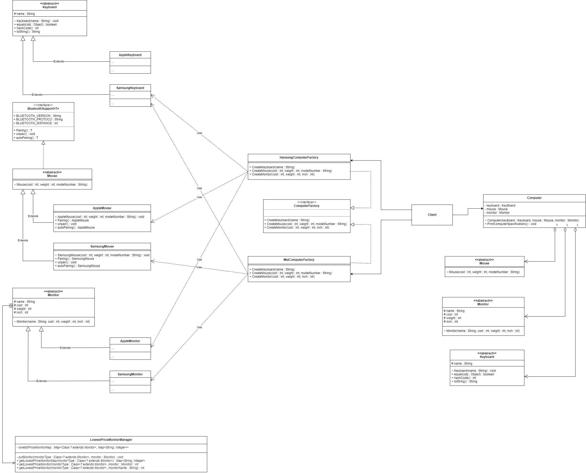

# 추상 팩토리 패턴(Abstract Factory Pattern)

--------------------

## **생성 패턴(Creational Patterns)**
> 객체를 생성(클래스의 인스턴스를 만드는 절차), 합성(Compositon) 하는 방법을 기존 클래스에서 분리한다.  
>  **(SOLID, Single Responsibility Principle : 단일 책임 원칙)**

> 필요시 클래스의 인스턴스(instance)를 만드는 절차, 과정을 추상화(Abstraciton) 한다.

> 객체의 표현 방법을 기존 클래스에서 분리 한다.

-------------------

