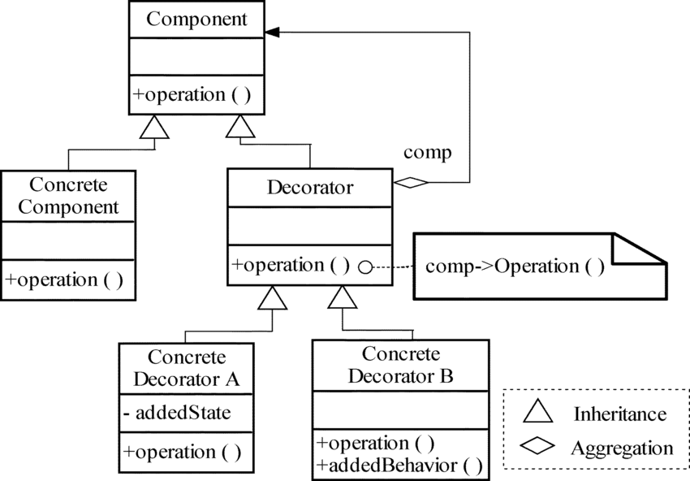

# 데코레이터 패턴(Decorator Pattern)



------------------

## 구조패턴(Structural Pattern)
> 구조 패턴은 클래스나 객체들을 조합해 더 큰 구조로 만들 수 있게 해주는 패턴이다.  
> 
> 구조 클래스 패턴은 상속(extends), 확장(implements)을 통해 클래스나 인터페이스를 합성한다.  
> 구조 객체 패턴은 객체를 합성(composition)하는 방법을 정의한다.

----------------

**HP**
> 캐릭터의 체력 값을 관리하는 클래스

**MP**
> 캐릭터의 마나 값을 관리하는 클래스

**Renderable**
> Rendering을 할 수 있는 기능을 구현 함 을 알리는 인터페이스  
> Rendering : (모델(model), 씬(scene), 스프라이트(sprite)를 모니터로 출력하는 것)

**HudRenderer** (Component)
> Hud를 시각적으로 출력하는 책임을 담당하는 추상 클래스

**CommonHudRenderer** (ConcreteComponent)
> 일반적으로 Hud를 시각적으로 출력하는 클래스. HudRenderer의 추상화 양식을 확장 해 사용한다.

**WarningHudRenderer** (ConcreteDecoratorA)
> 일반적으로 Hud를 시각적으로 출력하는 기능에 더해, 위험 상황(HP나 MP가 20% 미만)인 경우 경고 메시지를 추가로 출력하는 기능을 추가 해주는 클래스

**PercentHudRenderer** (ConcreteDecoratorB)
> 일반적으로 Hud를 시각적으로 출력하는 기능에 더해, 현재 잔여 HP와 MP를 백분율로 환산한 메시지를 추가로 출력하는 기능을 추가 해주는 클래스

**HudDecorator** (Decorator)
> 일반적으로 Hud를 시각적으로 출력하는 기능에 더해, 동적이고 객체지향적으로 Hud의 기본 출력 양식에 새로운 기능을 덧붙혀(꾸며서) 사용하기 위해 구체적인 데코레이터 클래스의 골격 클래스

----------------------------


## 장점
- **객체에 동적으로 새로운 책임을 추가할 수 있다.**  

```
  public static void main(String[] args) {
    Component conmonent = new ConcreteDecoratorA(new ConcreteDecoratorB(new ConcreteComponent()));

    Renderable hudRenderer =
        new PercentHudRenderer(new CommonHudRenderer(new HP(1000, 100), new MP(2000, 540)));
  }
```
CommonHudRenderer는 PercentHudRenderer로 꾸밀 수 있고, WarningHudRenderer로도 꾸밀 수 있고,
PercentHudRenderer와 WarningHudRenderer로 같이 꾸밀 수 있다.  
  
부가적인 코드 없이 생성자의 연쇄 호출 만으로 클라이언트는 쉽고 동적으로 원본 객체에 새로운 책임을 추가 할 수 있다.

- **상속 관계를 이용해 서브클래스가 계속 생기는 방법이 실질적이지 못할 때 유용하다.**  
  
커피숍을 운영하는 프로그램을 만든다고 예를 들자.  
기본적으로 제공하는 커피는 아메리카노, 라떼, 모카 등등 여러 커피가 있다.  
하지만 우리는 커피를 시킬 때 샷을 추가하거나, 시럽을 추가하거나, 휘핑을 추가하거나, 우유를 추가하는 등, 원하는 토핑을 추가해서 시킨다.  

만약 추상 클래스(abstract class) Coffee가 존재하고, 모든 종류의 커피를 구체 클래스(concrete class)로 만든다면 구체 클래스의 수는 커피의 종류와 토핑의 수의 곱집합과 같다. 위의 예시만 보아도 벌써 12개의 구체 클래스가 필요하다.

데코레이터 패턴은 기존 구체 클래스가 너무 많은 수의 독립된 확장을 요구할 때, 모든 조합을 지원하기 위해 기존 상속 설계 방식으로 구현이 부적절 할 경우 적합하다. 데코레이터 패턴은 확장(extends)과 구성(Composition)의 장점을 모두 더 한 설계다.

- **상위 클래스의 기능을 그대로 유지하면서, 상속의 유연함을 유지하고 싶을 때 유용하다.**

**상속은 기본적으로 캡슐화를 깨뜨린다.**
> 상위 클래스의 메소드 구현 방식에 따라 하위 클래스의 오버라이딩(overriding)된 메소드의 동작에 이상이 생길 수 있다.

> 상위 클래스의 설계가 견고하고, 확장을 위해 충분히 고려 한 설계이며, 문서화도 제대로 된 추상 클래스를 상속 받는 것은 안전하다. 반대로 이미 구체적인 구현과 클래스의 책임 할당이 끝난 구체 클래스를 직접 상속받는 것은 위험하다.

원소가 추가 될 때 마다 원소가 총 얼마나 추가되었는지 내부적으로 카운트하는 나만의 자료구조를 만들고 싶다고 가정하자.

Collection의 Set 자료구조는 내부적으로 원소의 순서를 보장하지 않고, 중복된 값을 허용하지 않는다.  
이 때 Set을 구현한 HashSet은 중복된 값을 판단하는 기준으로 객체의 hashCode의 동치성(equal)을 비교한다.
  
이 HashSet이 마음에 들어 HashSet을 상속 받고, 원소를 추가하는 add(), addAll()을 오버라이딩 하면
HashSet의 기능을 온전히 이용하면서 원하는 기능을 손쉽게 구현 할 수 있을 것 같다.

```
public class InstrumentedHashSet<E> extends HashSet<E> {
  private int addCount = 0;

  public InstrumentedHashSet(){}

  public InstrumentedHashSet(int initCap, float loadFactor){
      super(initCap, loadFactor);
  }

  @Override
  public boolean add(E e) {
      addCount++;
      return super.add(e);
  }

  @Override
  public boolean addAll(Collection<? extends E> c) {
      addCount += c.size();
      return super.addAll(c);
  }

  public int getAddCount() {
      return addCount;
  }
}
```

```
  public static void main(String args[]){
    InstrumentedHashSet<String> s = new InstrumentedHashSet<>();
    s.addAll(List.of("틱", "탁탁", "펑"));

    System.out.println(s.getAddCount());
  }
```

원소가 총 3개 추가 되었으니 addCount는 3 이라고 생각하겠지만, 실제로는 6이 출력된다.  
그 원인은 HashSet의 addAll()은 내부적으로 add를 입력받은 파라미터의 갯수만큼 호출한다.
addAll()의 내부 구현은 add()에 의존한다.  
  
우리는 add() 또한 오버라이딩 했고, 결국 원소 하나당 addCount는 두 번 증가한 것이다.  
즉 addAll() 메소드를 오버라이딩 할 필요는 없었던 것이다.  
  
하지만 남이 만든 클래스나, 방대한 자바 라이브러리의 내부 구현을 통째로 외운 사람은 없다.  
애초에 구체 클래스를 상속받은 행위 자체가 위험한 것이다.

또한 자바 라이브러리가 업데이트 되어서 HashSet의 addAll() 메소드의 구현이 바뀌었다면, 상황이 복잡해진다. InstrumentedHashSet은 자신의 상위 클래스(HashSet)의 추상화 수준을 전혀 누리지 못하고, 오히려 상위 클래스 HashSet의 구현에 대해 강하게 의존하고 있다. **(SOLID, Dependency Inversion(의존 관계 역전 원칙) 위배)**
  
상위 모듈에 하위 모듈이 의존하게 되면 생기는 가장 고통스러운 점은 디버깅이 쉽지 않다는 것이다. 버그가 발생한 지점을 찾기 위해 상위 클래스(HashSet)의 호출 스택까지 올라가는건 어떤 개발자도 바라지 않을것이다.
  
HashSet에 새로운 메서드가 추가된다면, 그 메서드를 그대로 상속받는 하위 클래스에서 실수로 호출 할 시 쉽게 불변식이 깨지거나, 보안 상 이슈가 발생할 수 있다.

견고해보이는 자바 Collection 조차 이런 설계가 존재하는데, 대표적으로 Stack은 Vector가 아니지만(is-a 관계 성립 안함) 상속으로 구현하였고, Properties또한 Hashtable을 확장해서는 안됬다.

|HashTable|Properties|
|------|---|
|public synchronized V get(Object key)|String getProperties(String key)|

예를 들어 Properties의 인스턴스인 p가 있다고 가정해보자. 웃기게도 p.getProperty(key)와 p.get(key)의 결과는 다를 수 있다. getProperty()는 Properties 클래스의 책임에 맞는 일을 하지만, 같은 일을 하는 메서드인 get()이 상위 클래스인 Hashtable에 이미 있었기 때문이다. Properties는 키(key)와 값(value)으로 문자열(String)만 사용 할 수 있게 하려 했으나, p.get(key)를 하는 순간 Properties의 불변식은 허무하게 깨져버린다.
  
아무래도 HashSet을 직접 상속받는 것은 바람직 하지 않는 것 같다. 상속(extends) 대신 인터페이스를 이용한 구현(implements) 으로 유연함과 견고함을 늘리고, 구성(composition)과 전달(forwarding) 기법을 추가해 InstrumentedHashSet를 구현해 보자.

```
public class ForwardingSet<E> implements Set<E> {
  private final Set<E> s;

  public ForwardingSet(Set<E> s) {
    this.s = s;
  }

  public void clear() {
    s.clear();
  }

  public boolean contains(Object o) {
    return s.contains(o);
  }

  public boolean isEmpty() {
    return s.isEmpty();
  }

  public int size() {
    return s.size();
  }

  public Iterator<E> iterator() {
    return s.iterator();
  }

  public boolean add(E e) {
    return s.add(e);
  }

  public boolean remove(Object o) {
    return s.remove(o);
  }

  public boolean containsAll(Collection<?> c) {
    return s.containsAll(c);
  }

  public boolean addAll(Collection<? extends E> c) {
    return s.addAll(c);
  }

  public boolean removeAll(Collection<?> c) {
    return s.removeAll(c);
  }

  public boolean retainAll(Collection<?> c) {
    return s.retainAll(c);
  }

  public Object[] toArray() {
    return s.toArray();
  }

  public <T> T[] toArray(T[] a) {
    return s.toArray(a);
  }

  @Override
  public boolean equals(Object o) {
    return s.equals(o);
  }

  @Override
  public int hashCode() {
    return s.hashCode();
  }

  @Override
  public String toString() {
    return s.toString();
  }
}
```

```
public class InstrumentedSet<E> extends ForwardingSet<E> {
  private int addCount = 0;

  public InstrumentedSet(Set<E> s) {
    super(s);
  }

  @Override
  public boolean add(E e) {
    addCount++;
    return super.add(e);
  }

  @Override
  public boolean addAll(Collection<? extends E> c) {
    addCount += c.size();
    return super.addAll(c);
  }

  public int getAddCount() {
    return addCount;
  }
}
```


상속 대신 추상화된 인터페이스를 구현 함으로 써 견고하고 유연한 설계를 얻게 되었다.
심지어 InstrumentedSet 클래스의 내부 구현 방식은 HashSet에 의존하지 않고, Set을 구현한 클래스라면 모두 InstrumentedSet의 내부 구현 방식으로 쓸 수 있으며, 어떤 클래스를 사용할 지를 동적으로 바꿀 수 있다. **(dependency injection, 의존성 주입)**

ForwardingSet 클래스와 InstrumentedSet 클래스는 아무 일도 하지 않는다. 모든 로직은 내부의 Set 인스턴스가 처리하며, 마치 다른 Set 인스턴스를 감싸고(wrap) 있는 것 처럼 보인다. 이런 클래스를 래퍼 클래스(wrapper class)라고 한다. 또 InstrumentedSet 클래스는 Set을 구현한 기존 클래스에 계측 기능을 덧 붙혀 기존 클래스를 꾸며주는 것 처럼 보이기도 하다. 데코레이터 패턴이다.

이펙티브 자바에서는 컴포지션과 전달의 조합을 넓은 의미로 위임(delegation)이라고 부르지만, 엄밀히 따지면 래퍼 객체가 내부 객체에 자기 자신의 참조를 넘기는 경우만 위임에 해당한다고 한다.

상속은 반드시 하위 클래스가 상위 클래스의 "진짜" 하위 타입인 상황에서만 쓰여야 한다. is-a 관계가 성립되지 않는다면, 상속 대신 컴포지션을 고려해야 한다.

데코레이터 패턴에도 단점이 있는데 콜백(callback) 프레임워크와는 어울리지 않는다고 한다.

영어 실력이 좋은 분들은 참조 해도 좋은 글 http://bit.ly/2LepViV
